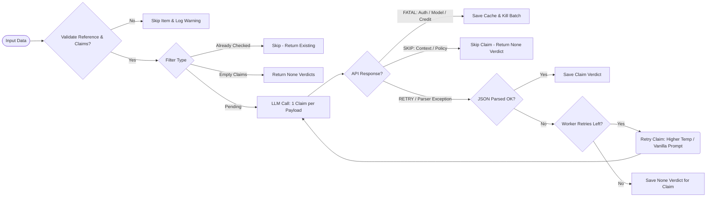
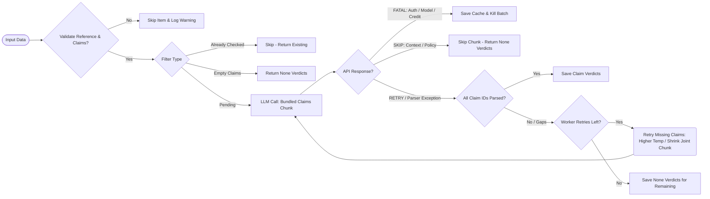

# Claim Entailment Checking — `CheckingService` & `Checker`

The claim entailment checking pipeline verifies whether LLM-extracted knowledge graph triplets (subject-predicate-object claims) are factually supported by their ground-truth reference passages.

---

## Pipeline Overview

```
Input (list[dict])
  │
  ├─ _canonicalize_keys()  →  Normalizes key aliases in-place ('context' → 'reference')
  ├─ _validate()           →  Keeps valid items, normalizes triplets, runs context checks
  │   ├─ canonicalize_triplets()  → Normalizes legacy triplet arrays to canonical dicts (shared util)
  │   └─ _warn_oversized_references() → Advisory warning if reference exceeds context budget
  ├─ _filter()             →  Splits valid items into: pending / empty claims / already-checked
  ├─ Execution             →  Delegates to the Checker worker (async + concurrency + progress bar)
  │   ├─ Joint Mode (Default)      → Bundles multiple claims using dynamic context chunking
  │   └─ Single Mode               → One LLM call per claim
  └─ _serialize()          →  Writes verdict + explanation directly into each triplet dict
```

For a detailed view of error handling, client classification, retries, and dynamic claim-gap recovery, see the [Checker Flow Diagram](checker_flow.md).

### Single Mode Flow (`--no-joint`)



### Joint Mode Flow (Default)



---

## Pipeline Steps in Detail

### Step 0: Key Canonicalization (`_canonicalize_keys`)
Different datasets use different key naming conventions for the same logical concepts. Before any validation or checking begins, `CheckingService` normalizes these in-place:
* Mappings:
  * `"context"` → `"reference"` (if `"reference"` is not already present)
  * `"query"` → `"question"` (if `"question"` is not already present)

### Step 1: Validation & Normalization (`_validate`)
Ensures that all items contain the necessary data to perform entailment checking.
1. **Required Keys**: An item must have a `reference` key (the reference passage) and the specified `{extractor_model}_response_kg` key. Items missing either of these are dropped with a warning.
2. **Triplet Canonicalization (`canonicalize_triplets`)**: Supports converting legacy flat-triplet arrays to canonical dictionaries in-place using the shared `utils.py` function.
   * **Legacy format**: `{"triplet": ["renewal of nexus card", "takes", "anywhere from a couple of weeks to about 3 months"], "human_label": "Entailment"}`
   * **Canonical format**: `{"subject": "renewal of nexus card", "predicate": "takes", "object": "anywhere from a couple of weeks to about 3 months", "human_label": "Entailment"}`
3. **Global Gate**: At least one item in the batch must survive validation and contain non-empty claims. If zero items survive, `InvalidInputError` is raised (hard stop).
4. **Context Warning (`_warn_oversized_references`)**: If `max_words` is set (which defaults to `6000` in joint mode), the service checks if any reference passage exceeds the safe budget:
   $$\text{Budget} = \text{max\_words} \times 0.75$$
   If the word count exceeds this budget, an advisory warning is logged (e.g. `⚠️ Item 3: reference is 5200 words (budget: 4500). Context may be too large...`). This warning does not drop the item but alerts the user of potential context window pressure.

### Step 2: Filtering (`_filter`)
Avoids redundant work and avoids making useless LLM calls on empty claims. Items are categorized as:
* **Pending**: Valid items containing claims that need checking.
* **Already Checked**: Items that already contain `{model}_checker_verdict` inside their triplets. These are skipped to support **resumability**.
* **Empty Claims**: Items where `{extractor_model}_response_kg` is an empty list `[]` (from an abstention or extraction error). These are skipped.

If all items are either already checked or have zero claims, `FilterError` is raised (hard stop).

---

## Execution Modes

The `CheckingService` supports two modes of operation: **Joint Mode** (economical, default) and **Single Mode** (granular, `--no-joint`).

### 1. Joint Checking Mode (Default)
Bundles multiple claims for a single reference passage into a single LLM call. This reduces API costs and improves execution speed by up to 90%.

#### Dynamic Context Budgeting (`_effective_joint_num`)
Rather than sending a fixed chunk of claims (which could lead to context window overflow on large references), the service dynamically adjusts the chunk size for each item individually.
* **Overhead buffer**: Leaves a 100-word buffer for prompt templates.
* **Word limit**: Available space for claims is calculated as:
  $$\text{Available Words} = (\text{max\_words} \times 0.75) - \text{reference\_words} - 100$$
* **Average claims limit**: Estimates the average word count per claim. It divides the available words by the average claim size to find how many claims fit.
* **Safe Fallback**: If the reference passage alone takes up the entire budget, the service falls back to checking `1` claim at a time. The final effective chunk size is constrained between `1` and `joint_num`.

#### Bracketed Claim IDs & Prompting
Claims are formatted with numerical bracketed IDs:
```text
[1] USB port can connect to multiple peripheral devices
[2] USB port is an external bus standard
```
The LLM is asked to output a JSON object containing a list of verdicts matched to these IDs.

#### Gap & Hallucination Handling
If the LLM response is missing an expected claim ID (a gap), or returns an unexpected claim ID (a hallucination), the system captures it. Gaps are filled with a `None` verdict so they can be processed or retried later.

---

### 2. Single Checking Mode (`--no-joint`)
Evaluates each claim individually using one LLM call per claim.
* **Flattening**: The triplet is joined into a natural sentence claim: `"{subject} {predicate} {object}"`.
* **Behavior**: Useful when maximum precision is needed or when the LLM struggles with structured list outputs. However, this is significantly slower and more expensive.

---

## Output Data Format & Serialization

Verdicts and explanations are serialized **directly inside each triplet dictionary**. This keeps all information related to a claim in one self-contained structure.

For a checking model run with name `gemini-3.1`, two keys are added to each triplet:
1. **`{model}_checker_verdict`**: One of:
   * `"Entailment"`: The claim is supported by the reference.
   * `"Contradiction"`: The claim is explicitly contradicted by the reference.
   * `"Neutral"`: The reference does not contain information to verify or contradict.
   * `null` (None): If the checking or parsing failed.
2. **`{model}_checker_explanation`**: Detailed chain-of-thought reasoning explaining the decision.

### Output JSON Example
```json
{
  "response": "A USB port is an external bus standard...",
  "reference": [
    "A USB port is an external bus standard that supports data transfer rates...",
    "It also allows you to connect up to 127 peripheral devices directly."
  ],
  "llama3_response_kg": [
    {
      "subject": "USB port",
      "predicate": "can connect to multiple peripheral devices",
      "object": "peripheral devices",
      "gemini-3.1_checker_verdict": "Entailment",
      "gemini-3.1_checker_explanation": "The reference explicitly states that a USB port allows connecting up to 127 peripheral devices, supporting the claim that it can connect to multiple peripheral devices."
    }
  ]
}
```

---

## CLI Parameters and Flags

Trigger entailment checking via the `check` command:

```bash
contextchecker check <input_file> [options]
```

### Arguments and Options

| Parameter | Command Flag | Default | Description |
|---|---|---|---|
| **Input File** | `input_file` *(Argument)* | *Required* | Path to the JSON file with extracted knowledge graph triplets. |
| **Extractor Model** | `--extractor-model`, `-e` | *Required* | The model name that was used for extraction (used to read the `{extractor_model}_response_kg` key). |
| **Output File** | `--output`, `-o` | `results/{input_stem}_check.json` | Output JSON file path, written next to the input. The `results/` directory is automatically created. |
| **Checker Model** | `--model`, `-m` | `None` | Model name for the checker LLM (e.g. `gemini-3.1`). Determines output keys. |
| **API Base URL** | `--checker-base-api` | `None` | Optional base URL override for the checker LLM API. |
| **Joint Mode Toggle** | `--joint` / `--no-joint` | `True` | Toggle joint checking (multiple claims per LLM call) on or off. |
| **Max Bundle size** | `--joint-num` | `10` | The maximum number of claims to bundle in a single joint call. |
| **Word Budget** | `--max-words` | `6000` *(Joint Mode)*<br>`None` *(Single Mode)* | Word budget per LLM call. Limits chunk size in dynamic context calculations. |
| **Debug Mode** | `--debug` | `False` | Enable debug logs showing timestamps, source modules, and API payload details. |

---

## Technical Performance Details

### Chain-of-Thought (CoT) Schema
To prevent the LLM from making hasty judgments, both single and joint Pydantic schemas require the `explanation` field to be defined **before** the `verdict` field. This forces the LLM to generate its reasoning sequence first in the raw JSON output stream, which significantly boosts accuracy on challenging verification tasks.

### Concurrency
All calls are managed asynchronously using `LLMClient`'s concurrency queue. The default checking concurrency is `10` simultaneous requests, displaying a clean `tqdm` progress bar during execution.
