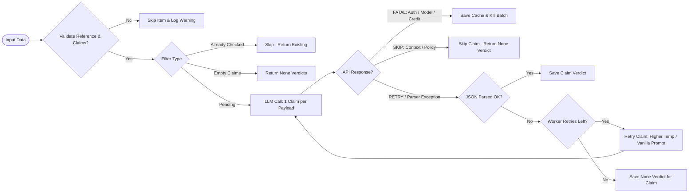
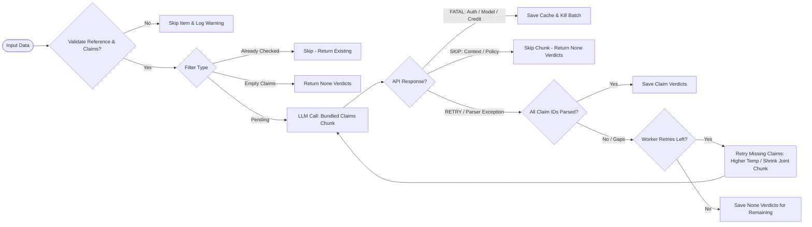

# Checker Execution Flow

This document details how the `CheckingService` and `Checker` worker process claims, handle API responses/errors, perform retries, and recover from failures in both **Single Mode** and **Joint Mode**.

---

## 1. Single Mode Flow (`--no-joint`)

In Single Mode, the pipeline evaluates every claim individually, executing one LLM call per claim.

---

## 2. Joint Mode Flow (Default)

In Joint Mode, the pipeline groups multiple claims into numbered chunks and sends them together in a single request, dynamically adjusting the chunk size to respect the context window budget.

---

## Description of Flow Steps

1. **Input Validation**: Verifies that each item has a reference passage and extracted triplets. Triplet fields are normalized to canonical structures. If no items survive, an `InvalidInputError` is raised.
2. **Filtering**: Categorizes valid items to minimize API calls:
   - **Already Checked**: Skips items that already contain evaluation verdicts.
   - **Empty Claims**: Skips items with empty source triplet lists (due to extraction abstentions or failures), returning `None` verdicts.
   - **Pending**: Passed to the `Checker` worker.
3. **Execution Mode Branching**:
   - **Single Mode**: Flattens each claim into a separate task/payload and sends them one-by-one.
   - **Joint Mode**: Dynamically calculates how many claims can fit into the context window budget alongside the reference text and groups them into numbered chunks.
4. **Error Handling & Classification**:
   - **FATAL errors** (like connection failures, invalid API keys, or credit exhaustion) trigger cache persistence and terminate the entire run.
   - **SKIP errors** (e.g. context window limits or content policy blocks) skip only the affected items/chunks, assigning them `None` verdicts.
5. **Worker Retries & Claim Gap Recovery**:
   - **Single Mode Retries**: If the individual claim JSON fails to parse, it is retried in subsequent rounds with increased temperatures and fallback prompts. If all retries fail, it gets a `None` verdict.
   - **Joint Mode Retries**: If the LLM response contains gaps (missing bracketed claim IDs) or fails to parse, the worker initiates retry rounds. In each retry round, it dynamically constructs a **smaller joint request** containing only the failed/missing claims for that chunk, optimizing token usage. Remaining unresolved claims are filled with `None` verdicts after retries are exhausted.
