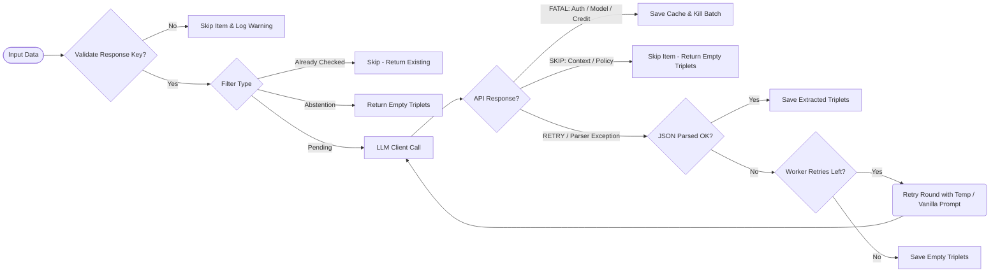

# Extractor Execution Flow

This flowchart describes how the `ExtractionService` and `Extractor` worker handle validation, filtering, API responses, errors, and worker-level retries.

## Description of Flow Steps

1. **Input Validation**: Filters out any data items missing the `"response"` key. If no items survive, execution stops with an `InvalidInputError`.
2. **Filtering**: Classifies valid items into three categories:
   - **Already Checked**: Items that already have extraction results are skipped to allow resuming.
   - **Abstention**: Input responses that are empty or match refusal phrases (e.g. "I don't know") are returned with empty triplets without an LLM call.
   - **Pending**: Passed to the `Extractor` worker.
3. **LLM Client Call**: Sends payloads concurrently to the LLM client.
4. **Error Handling & Classification**:
   - **FATAL errors** (like connection failures, invalid API keys, or credit exhaustion) trigger cache persistence and terminate the entire run.
   - **SKIP errors** (like context-window exceeded or safety policy violations) result in the specific item returning empty triplets, while other items continue.
   - **RETRY errors** (like transient rate limits or server timeouts) are handled inside `LLMClient` with exponential backoff and retried.
5. **Worker Retries**: If the raw LLM response fails to parse against the JSON schema, the worker triggers retry rounds (up to $X$ configured attempts, e.g. using a higher temperature or simplified vanilla prompt) before giving up and returning empty triplets.
